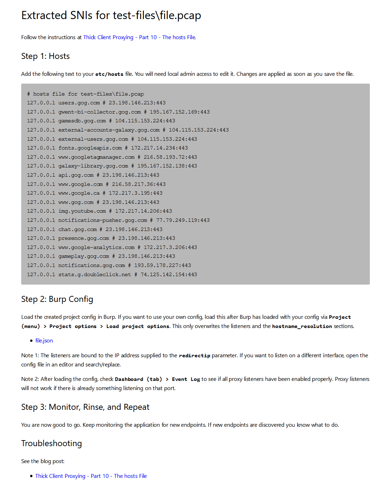

# extract-sni <!-- omit in toc -->
Extracts SNIs from a pcap and generates output usable in `etc/hosts` file and
Burp config for proxying non-proxy-aware thick clients using HTTPs.

## Quickstart

1. `go get github.com/parsiya/extract-sni`
2. Capture traffic for an application and store it in a pcap file.
3. `go run extract-sni.go whatever.pcap -output report`
4. Open `report.html` to view the instructions.
    1. Some text should be copied to `etc/hosts` to redirect traffic to Burp.
5. Import `report.json` in Burp as the project config to setup proxy listeners
   and hostname resolution.
6. ???
7. Profit

## Table of Contents <!-- omit in toc -->
- [Quickstart](#quickstart)
- [No, Really? How do I Use This?](#no-really-how-do-i-use-this)
    - [Why?](#why)
- [Pre-requisites](#pre-requisites)
    - [npcap Must be Installed](#npcap-must-be-installed)
- [Usage](#usage)
    - [pcap file](#pcap-file)
    - [DNS -d/-dns](#dns--d-dns)
    - [Redirect IP -r/-redirectip](#redirect-ip--r-redirectip)
    - [Output -o/-output](#output--o-output)
- [Limitations](#limitations)
- [Questions](#questions)
- [Troubleshooting](#troubleshooting)
    - [My Output File is Noisy](#my-output-file-is-noisy)
    - [Error `Couldn't load wpcap.dll`](#error-couldnt-load-wpcapdll)
- [Samples](#samples)
- [License](#license)

## No, Really? How do I Use This?
You have a non-proxy-aware thickclient that uses HTTPs. This means it does not
like the Windows proxy settings or any other proxy settings. It does not
[send the CONNECT request][proxy-aware].

[proxy-aware]: https://parsiya.net/blog/2016-07-28-thick-client-proxying-part-6-how-https-proxies-work/#5-proxy-aware-clients

Read this blog post to get started:

* https://parsiya.net/blog/2020-05-09-thick-client-proxing-part-10-the-hosts-file/

If the application uses HTTPs then we can process SNI

### Why?
Because [Manual Work is a Bug][manual-link]. This program automates some of the
process.

[manual-link]: https://queue.acm.org/detail.cfm?id=3197520

## Pre-requisites
You need Burp. **Both the pro and community versions work**. Other proxy tools
(Fiddler, ZAP, etc.) might work with modification but the config file is created
for Burp.

### npcap Must be Installed
On Windows, you need to install [npcap](https://nmap.org/npcap/#download) for
the Golang's pcap library to work. Be sure to check
`Install Npcap in WinPcap API-compatible Mode` in the installer
(it's enabled by default).

I have not tested this tool on other operating systems.

## Usage
The only required parameter is the pcap file. Running `extract-sni traffic.pcap`
will create a report named `traffic.html` and a Burp config file name
`traffic.json` in the same path as the pcap file.

Use `-h` or `--help` to see the complete usage.

### pcap file
Pass the pcap file. This is a positional and the only required parameter.

* `extract-sni.go whatever.pcap`

### DNS -d/-dns
Optional DNS for domain lookup. If this parameter is not provided then the
application uses the destination IP address from the pcap file for each domain.

If provided, the DNS server will be used to do lookups. The value can be a
complete `server:port` like `dns.google:53`, or `IP:port` like `8.8.8.8:53`.
Port is optional and will default to `53`. Both `8.8.8.8` and
`dns.google` are both valid values.

The application does some validation checks here but it's mostly the
responsibility of the user to pass a valid and reachable DNS server.

### Redirect IP -r/-redirectip
Use the IP address that you want the traffic to be redirected to. This is used
in two places:

1. The `hosts` file.
2. The Burp proxy listener will listen on this IP address.

For most uses cases this parameter does not need to be provided and the default
value `127.0.0.1` is good enough.

Note: Only use IP addresses here, not domains like `example.net` or `localhost`.

### Output -o/-output
The path of the report. The report contains the instructions on how to set up.
The Burp config file will appear in the same path but with the `json` extension.

Any extension here will be ignored. For example, `-o report.txt` will result in two
files:

1. `report.html`: Report with instructions.
2. `report.json`: Burp config file.

If this parameter is not used, the name of the pcap file is used. For example
`extract-sni app-capture.pcap` creates: `app-capture.html` and
`app-capture.json` in the same path as the pcap file.

## Limitations
The tools does not do everything.

1. You need to create the pcap. Use Wireshark or Netmon.
2. You need to filter the noisy traffic. In Wireshark, you can filter the
   traffic and in Netmon you can capture traffic for specific processes.
3. You need to bypass any certificate pinning.
    1. Usually, [adding Burp's CA to the Windows certificate store][burp-cert]
       is enough.
4. The config is for Burp. You could probably replicate it for other proxies but
   I only use Burp.
5. If there is no SNI header in the `ClientHello` the tool cannot determine the
   endpoint. This is usually the case when the application uses an IP address to
   target the endpoint.
    1. Similarly, the `hosts` file cannot redirect IP addresses, only domains.

[burp-cert]: https://parsiya.net/blog/2016-02-21-installing-burp-certificate-authority-in-windows-certificate-store/

## Questions

1. Why doesn't it capture pcaps, too?
    1. It's a small tool that does one thing. Feature creep is bad.
    2. It's easier to filter the traffic and reduce noise with Wireshark or
       Netmon.

## Troubleshooting

### My Output File is Noisy
Your pcap is noisy. Try to filter as much unrelated traffic as you can. I use
the techniques described in `Network Traffic Attribution on Windows`:

* https://parsiya.net/blog/2015-08-01-network-traffic-attribution-on-windows/

I usually use [Microsoft Network Monitor][netmon] or Netmon. With Netmon you can
filter traffic by process. However, this adds an extra step. Netmon's cap file
must be converted to pcap using Wireshark (or other tools). Keep in mind that
sometimes Wireshark cannot [convert cap files to pcap][cap-to-pcap].

[netmon]: https://www.microsoft.com/en-ca/download/details.aspx?id=4865
[cap-to-pcap]: https://parsiya.net/cheatsheet/#open-a-network-monitor-cap-file-in-wireshark-and-save-is-disabled

### Error `Couldn't load wpcap.dll`
`npcap` is not installed. See the [npcap](#npcap) section above for more info.

## Samples
See a report sample:

* [Report](report-sample/file.html)
* [Burp config](report-sample/file.json)

The screenshot from a report:

## License
Opensourced under the MIT license. See the [LICENSE](LICENSE) file for details.
